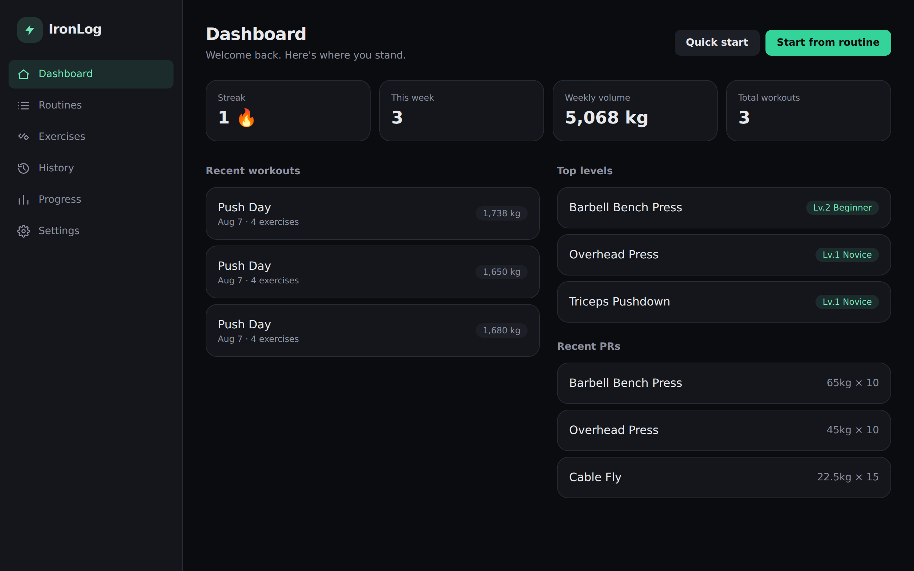
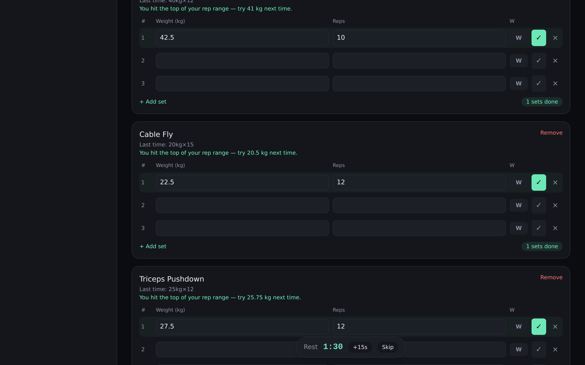
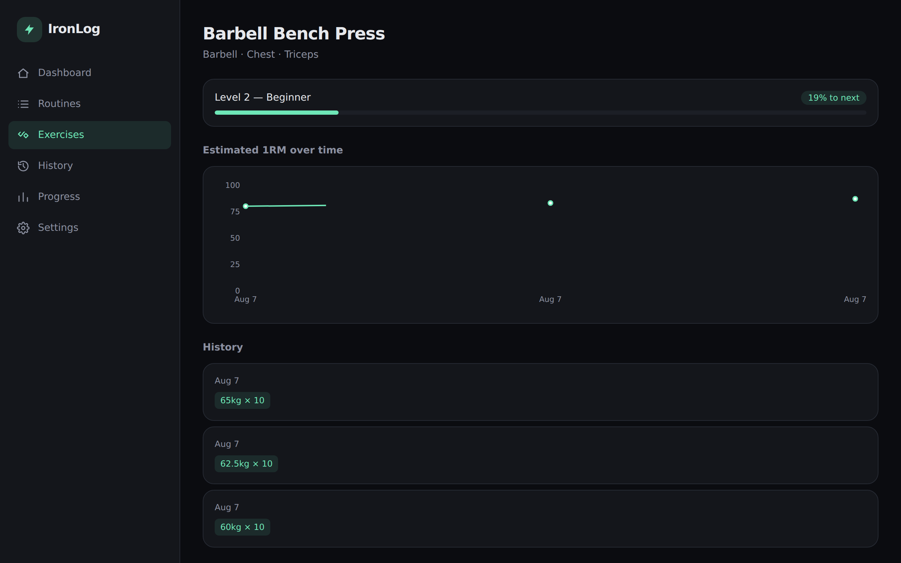
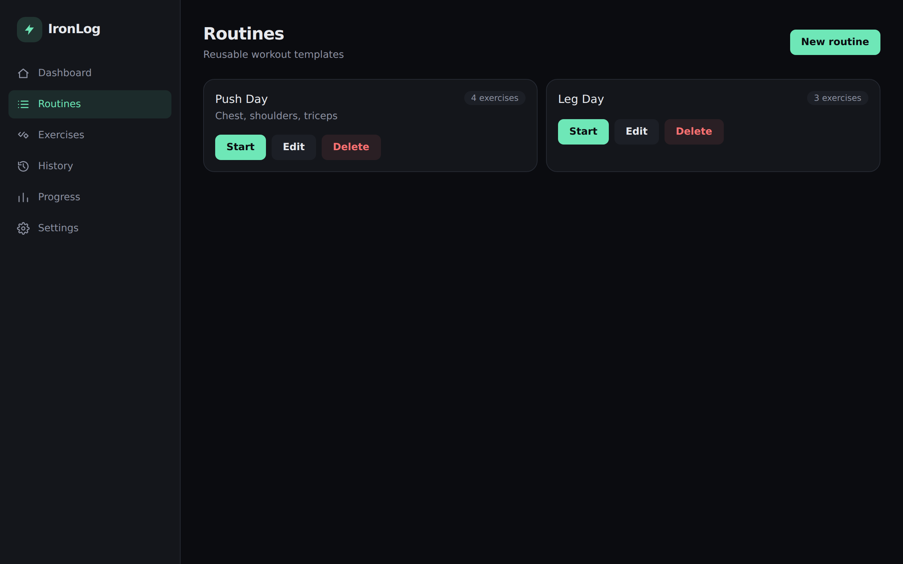
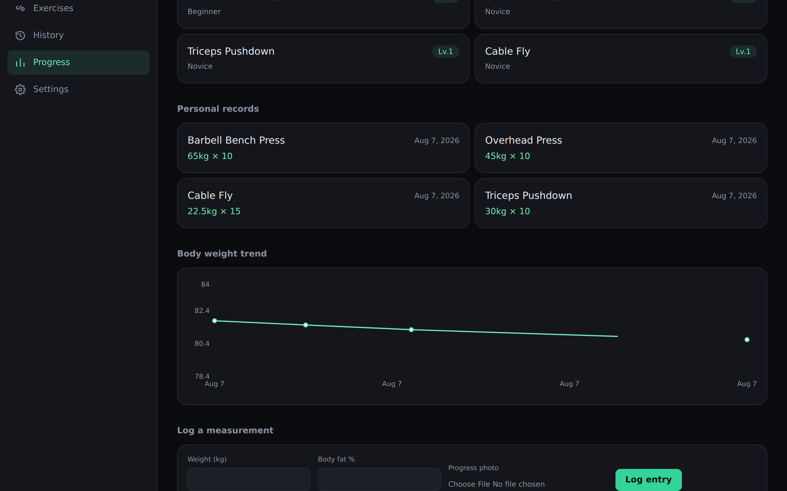
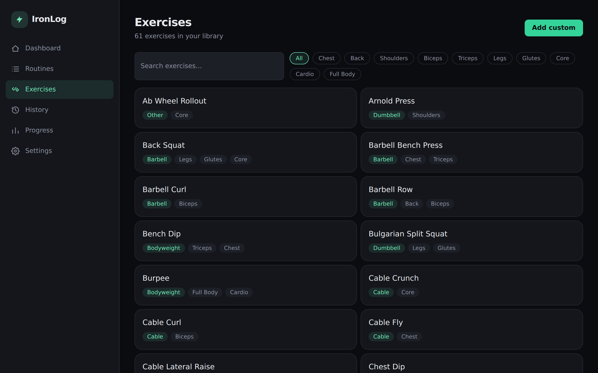
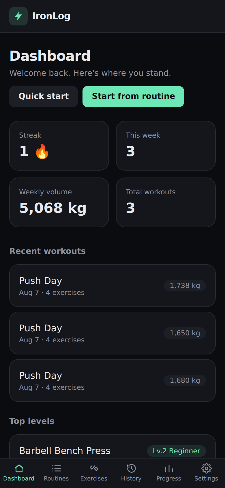

# IronLog

A gym workout tracker built as a portfolio project: log workouts against routines, watch progress climb through auto-detected PRs and a level system, and track body measurements over time. Everything runs client-side — no backend, no account, no ads.



## Features

- **Routines** — build reusable templates (exercises, target sets, target rep ranges), then start a fully pre-loaded workout in one tap.
- **Workout logger** — log weight × reps per set, mark warmups, see your last performance for that exercise inline, get a progressive-overload suggestion ("aim for 11 reps" or "try 62.5 kg"), and run an automatic rest timer between sets.
- **Exercise library** — 60+ built-in exercises across every muscle group and equipment type, searchable and filterable, plus custom exercises.
- **Progress tracking** — estimated 1RM trend chart per exercise (Epley formula), auto-detected personal records, a transparent volume-based level system (Untrained → Legendary), and a body-weight/measurement log with optional progress photos.
- **History** — every finished workout with per-exercise breakdown and total volume.
- **Units & backup** — kg/lb toggle, configurable rest timer, and JSON export/import for moving data between devices.

All data is stored in `localStorage` — there's no server, so nothing leaves the browser.

## Screenshots

| Workout logging | Exercise progress |
| --- | --- |
|  |  |

| Routines | Progress & PRs |
| --- | --- |
|  |  |

| Exercise library | Mobile |
| --- | --- |
|  |  |

## Tech stack

- **React 19 + TypeScript**, built with **Vite**
- **Tailwind CSS 4** for styling, **React Router 7** for client-side routing
- **Zustand** (with `persist`) for state management backed by `localStorage`
- **Recharts** for trend charts, route-based code-splitting for the chart-heavy pages
- **Vitest** + Testing Library for unit tests

## Getting started

```bash
npm install
npm run dev       # start the dev server
npm run build      # type-check + production build
npm test           # run the unit test suite
```

## Project structure

```
src/
  types.ts             # domain types (Exercise, WorkoutSession, Routine, ...)
  lib/
    calculations.ts    # pure functions: 1RM, PRs, progression suggestions, levels, streaks
    seedExercises.ts   # built-in exercise library
    storage / format    # persistence helpers, unit/date formatting
  store/useStore.ts     # Zustand store (routines, sessions, measurements, settings)
  pages/                # one component per route
  components/           # shared UI (Layout, Card, Button, RestTimerBar, ...)
```

The scoring/progression logic (estimated 1RM, PR detection, progressive-overload suggestions, and the level system) is pure and unit-tested independently of the UI — see `src/lib/calculations.test.ts`.

## Design notes

This project is an original build inspired by the gym-tracker app category — it does not reuse any other app's code, backend, or branding. A couple of features common in AI-powered fitness apps (photo-based body scanning, a social feed) are intentionally out of scope, since those depend on proprietary models and a real multi-user backend; the level/rank system here is a transparent, formula-based alternative computed from your own logged volume.
